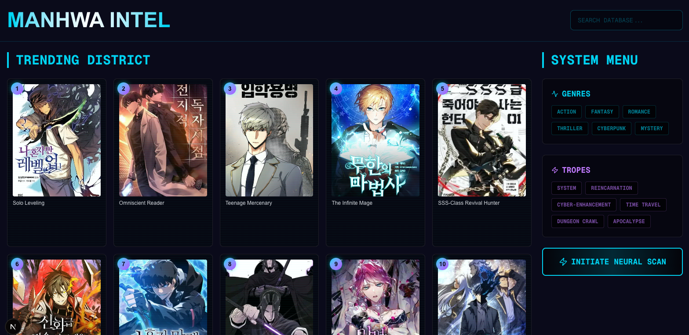

# Manhwa Intel
Smart manhwa recommendation platform with real-time trending data and genre-based matching.



## Live Demo
🔗 [Coming Soon](#)

## What It Does
- **Trending District** — Daily updated rankings pulled from Anilist & MangaDex APIs
- **Smart Recommendations** — "Neural Scan" matches users with manhwa based on selected genres and tropes
- **Smart Filtering** — Filter by genres (Action, Fantasy, Romance, etc.) and tropes (System, Reincarnation, Dungeon Crawl, etc.)
- **Search** — Fast search across 400+ titles

## Tech Stack

**Frontend**
- Next.js (App Router)
- TypeScript
- Tailwind CSS
- Custom cyberpunk UI system

**Backend**
- FastAPI (Python)
- SQLite database
- Rule-based recommendation engine
- Anilist & MangaDex API integrations

## Security Features
- CORS restrictions (specific origins only)
- Input sanitization (XSS/injection protection)
- Rate limiting (request throttling)
- Security headers (X-Frame-Options, XSS-Protection, etc.)
- Environment variables for configuration

## Technical Highlights
- CORS configuration for frontend/backend communication
- Rate limiting & input validation
- Error handling with loading states
- Responsive design

## Why I Built This
To demonstrate full-stack development with:
- Real third-party API integrations
- Production-style architecture (separate frontend/backend)
- Security best practices
- Clean, themed UI design

## Run Locally
```bash
# Frontend
cd manhwa-frontend
npm install
npm run dev

# Backend
cd /workspaces/manhwa-ai-app
.venv/bin/uvicorn api:app --reload --port 8000 --host 0.0.0.0
```

## Contact
Open to freelance work — [DM me](https://github.com/thecodeforgeai-debug)
